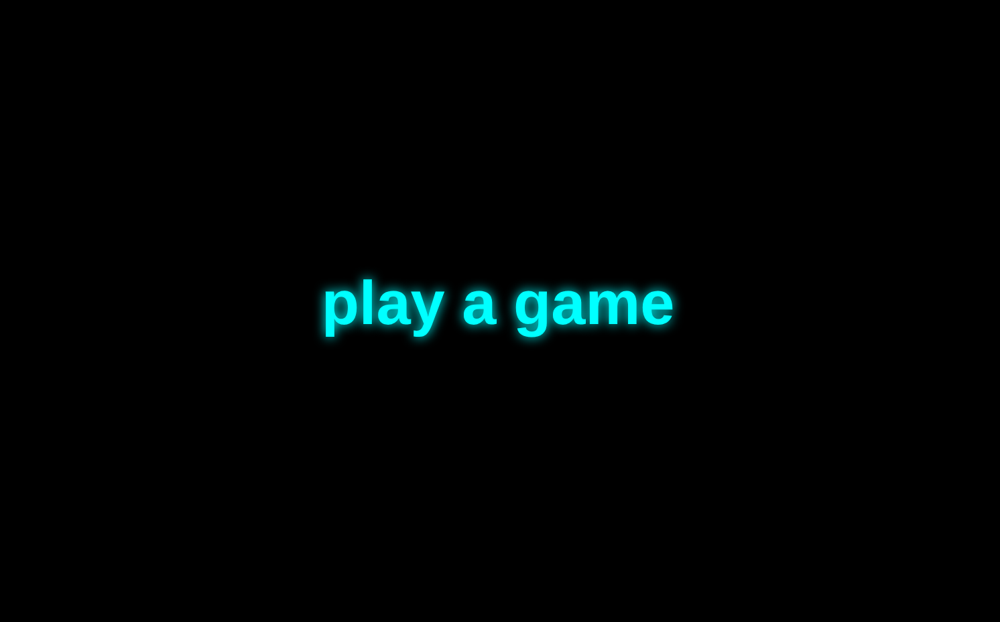

# play a game

  

---

# Eine Spiele-Sammlung, die Spiele wurden teils in Javascript oder mit der Godot Engine 4.6 erstellt.

---

# LICENSE

**Hinweis zu Lizenzen:**
Die Spiele in dieser Sammlung stammen aus unterschiedlichen Projekten und können jeweils eigenen Lizenzbedingungen unterliegen. Die jeweiligen Lizenzen sind in den entsprechenden Unterverzeichnissen oder den verlinkten Original-Repositories dokumentiert. Es liegt in der Verantwortung des Nutzers, diese zu beachten.

---
